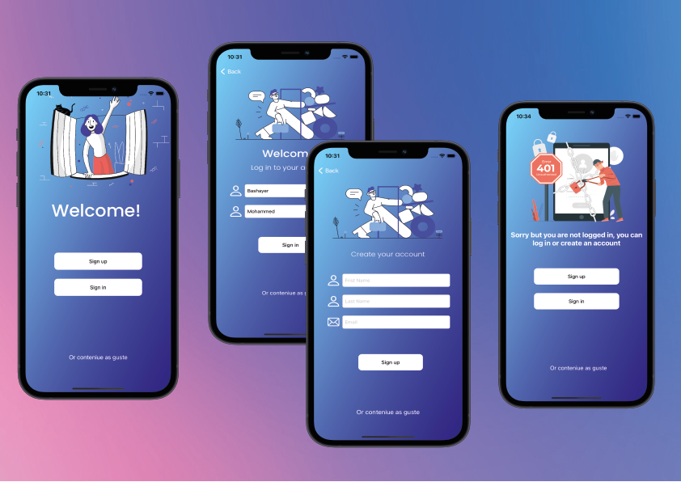
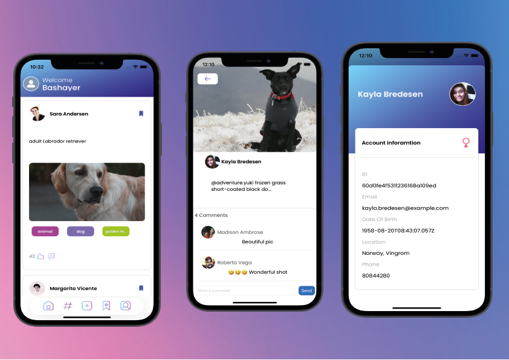
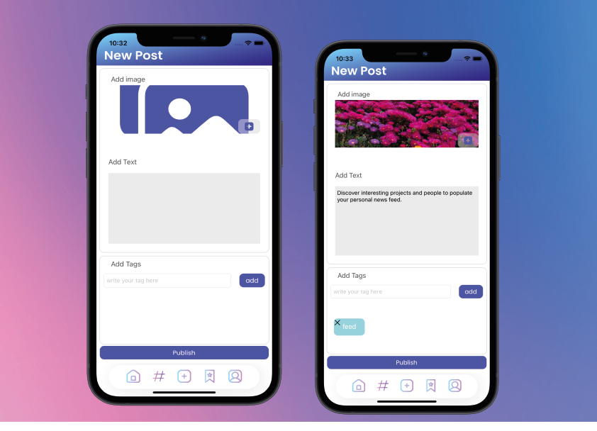
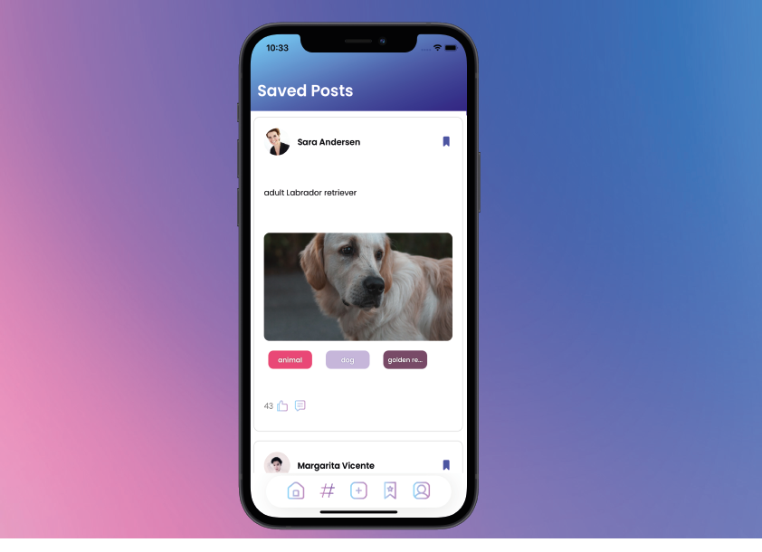
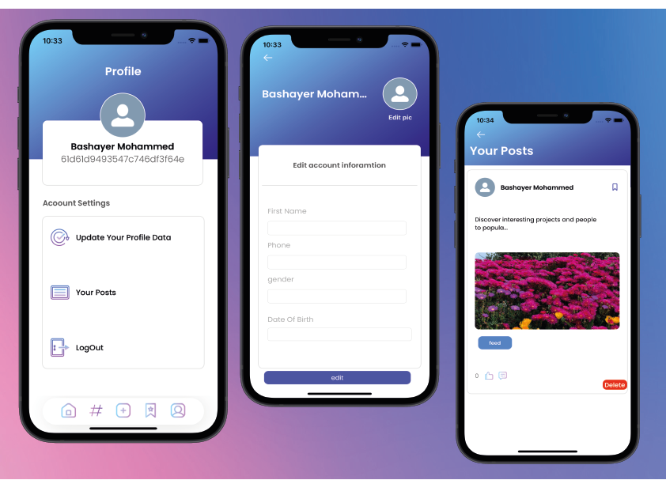

<h1 align="center"> BlogIN </h1> <br>
<p align="center">
  <a href="https://github.com/be1997s/FinalProject">
    
  </a>
</p>

<p align="center">
  Blog app, Built with swift UIkit.
</p>

## Table of Contents

- [Introduction](#introduction)
- [Features](#features)
- [Authorizing](#authorizing)
- [Home](#home)
- [Tags](#tags)
- [Add Post](#add-post)
- [Save Posts](#save-posts)
- [profile](#profile)
- [used libraries](#used-libraries)
- [Acknowledgments](#acknowledgments)

## Introduction

BlogIN is an iOS application created using Swift 5, it works on iPhone devices, <a href="https://dummyapi.io/">Dummy Api </a> used to create this app, but it is not a real API.</br>
The application was created using blue, purple, and pink themes. 
  </br>
<p align="center">
  
</p>

## Features

A few of the things you can do with  BlogIN:

* Register in the application and create an account.
* View posts activity feed.
* comment to posts.
* Share your posts.
* Search for tags.
* Save posts.
* Edit your information.

## Authorizing

The application allows registration or login if you are registered, but if you want not to, you can only browse the posts and tags.
 </br>
<p align="center">
  
  


## Home
On the home page, posts are displayed according to the latest, and you can review the post or the information of the owner of the post, you can also put a comment, or press the save button to save the post.
   </br>
<p align="center">
  


## Tags
User can show all tags and posts for each tag or search for a specific tag.
 </br>
<p align="center">
  


## Add Post
  
The registered user can add a post containing an image, text and tags.
 </br>
 
<p align="center">

  
</p>

The used Api does not support uploading images, so I used here to Firebase storage to upload image from iphone gallery and return the download link.
```javascript I'm A tab
self.storage.child("images/\(name).png").putData(imageData, metadata: nil) {_, err in
            guard  err == nil else {
              print("Failed to upload")
                return
            }
            self.storage.child("images/\(name).png").downloadURL{ URL, err in
                guard let urll = URL, err == nil else {
                  print(err)
                    return
                }
                let Stringurl = urll.absoluteString
                print("Download URL :\(Stringurl)")
                self.URL2 = Stringurl
                
                UserDefaults.standard.setValue(Stringurl, forKey: "url")
                SPIndicator.present(title: "Sucsess", message: "image uploaded Sucsessfuly!", preset: .done) {
                    self.uploadedimg.image = imageUrl.imageRELOAD(imageURL: self.URL2!)
                }
                
             }
        }
```


## Save Posts
The registered user can save posts and show them on the saved posts screen.
<p >
   </br>
<p align="center">
  
</p>

Also here the used API does not support saving posts, so I used here Firebase firestore to upload the id of the post and user id then return them if needed.

```javascript I'm A tab
 // Add a new document with a generated ID
   var ref: DocumentReference? = nil
    ref = self.db.collection("SavePosts").addDocument(data: [
        "UserId": userid,
         "PostId": [postid],
           ]) { err in
        if let err = err {
            print("Error adding document: \(err)")
        } else {
            print("Document added with ID: \(ref!.documentID)")
    }
      }
    
```
## profile
The registered user can modify his info and his picture, and he can show the posts he created and delete them if he wants, and he can also log out of the application.
 </br>
<p align="center">
  

  </br>


## used libraries
 
* <a href="https://github.com/Alamofire/Alamofire">Alamofire</a> For HTTP networking.</br>
* <a href="https://github.com/SwiftyJSON/SwiftyJSON">SwiftyJSON</a> For JSON data.</br>
* <a href="https://github.com/loryhuz/CleanyModal">CleanyModal</a> For alerts.</br>
* <a href="https://github.com/ivanvorobei/SPIndicator">SPIndicator</a> For For alerts.</br>
* <a href="https://github.com/hackiftekhar/IQKeyboardManager">IQKeyboardManagerSwift</a> For iPhone keyboard issues.</br>
* <a href="https://github.com/ninjaprox/NVActivityIndicatorView">NVActivityIndicatorView</a> For loading animations.</br>
* <a href="https://github.com/MengTo/Spring">Spring</a> For animation.</br>
* <a href="https://firebase.google.com/">Firebase Services</a> For cloud storage.</br>

## Acknowledgments

Thanks to the Tuwaiq Academy team for  the Swift bootcamp, and special thanks to the T.Yarob for his efforts for this bootcamp.


